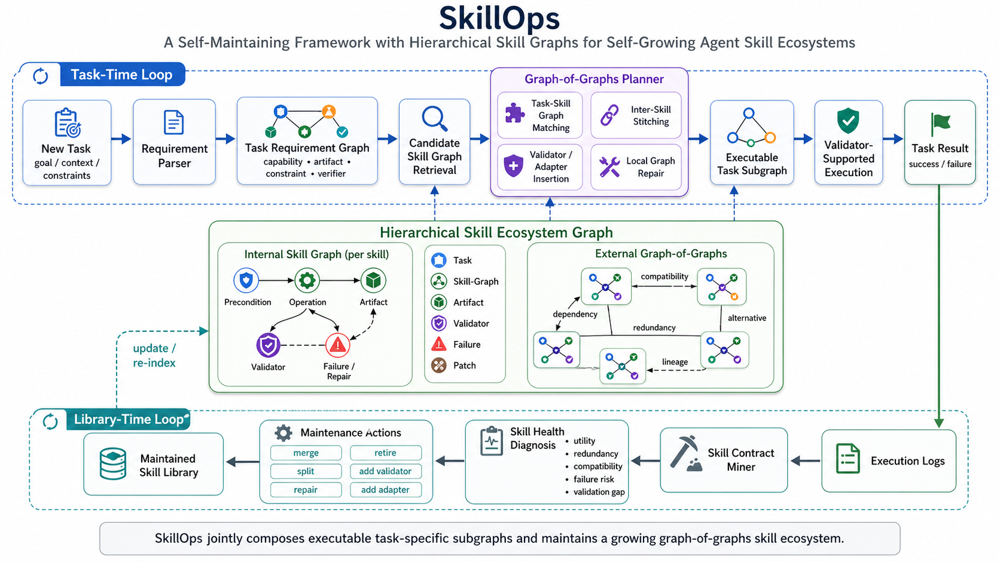

# SkillOps

<p align="center">
  <b>Managing LLM Agent Skill Libraries as Self-Maintaining Software Ecosystems</b>
</p>

<p align="center">
  <a href="https://arxiv.org/abs/2605.13716">
    
  </a>
  <a href="https://arxiv.org/pdf/2605.13716">
    
  </a>
  <a href="https://github.com/Hik289/SkillOps">
    
  </a>
  <a href="#installation">
    
  </a>
  <a href="#quick-start-5-lines">
    
  </a>
  <a href="LICENSE">
    
  </a>
</p>



**TL;DR.** SkillOps is a drop-in maintenance layer for LLM-agent skill
libraries. It turns a growing, messy set of reusable skills into a typed,
validated, graph-organized software ecosystem that downstream agents can use
without changing their task-time code. In the paper, SkillOps reaches
**79.5% task success on ALFWorld**, beating the strongest baseline by
**8.8 percentage points** with **no extra task-time LLM calls**.

**Paper:** [SkillOps: Managing LLM Agent Skill Libraries as Self-Maintaining
Software Ecosystems](https://arxiv.org/abs/2605.13716) (arXiv:2605.13716).

LLM agents increasingly rely on libraries of reusable *skills*. As agents
operate long-term, those libraries grow unbounded and degrade in quality:
skills become redundant, stale, under-specified, over-specialised, or have
missing validators and incompatible interfaces. This is the **technical-debt
problem** for agent skill ecosystems.

SkillOps treats skill maintenance as a first-class concern because task-time
repair is not enough: a patched episode can still leave duplicate skills,
missing validators, type mismatches, and stale implementations inside the
library for future agents to retrieve again. SkillOps diagnoses and repairs
that library-time technical debt before downstream retrieval or planning.

Every skill is modelled as an explicit five-tuple `(Precondition, Operation,
Artifact, Validator, Failure-modes)` (an *Internal Skill Graph*), and the
library is a typed *External Graph-of-Graphs* with five edge kinds
(`dependency`, `compatibility`, `redundancy`, `alternative`, `lineage`). On top
of that, SkillOps provides:

- a **Graph-of-Graphs Planner** that does signature lookup, inter-skill
  stitching, validator/adapter insertion and local repair,
- five **maintenance actions** (`merge`, `repair`, `retire`, `add_validator`,
  `add_adapter`) operating on the library between runs.

This repository ships the framework as a small, dependency-light Python
package, plus a hand-curated 12-skill demo library, smoke tests, and a one-line
CLI.


---

## Installation

```bash
git clone git@github.com:Hik289/SkillOps.git
cd SkillOps
pip install -e .
export OPENAI_API_KEY=sk-...   # only required for the LLM fallback
```

Python 3.9+ is required.

---

## Quick start (5 lines)

```python
from skillops import SkillLibrary, GraphOfGraphsPlanner

library = SkillLibrary.load_directory("examples/library")
library.build_edges()
planner = GraphOfGraphsPlanner(library)
result  = planner.plan({"task_id": "t1", "domain_type": "place_in_container",
                        "object": "apple", "parent": "fridge"})
print([a.to_str() for a in result.plan])
```

Run the bundled end-to-end demo (no API key needed):

```bash
python examples/demo.py
```

Or use the CLI:

```bash
python run_skillops.py --task "place a clean apple in the fridge" \
                      --library examples/library/
```

---

## Public API

### `Skill`, `SkillContract`, `SkillLibrary` (`skillops.skill_graph`)

Data classes for the Internal Skill Graph and the External Graph-of-Graphs.
`SkillLibrary.build_edges()` recomputes the typed edge set; `save`/`load` and
`load_directory` cover persistence.

### `GraphOfGraphsPlanner` (`skillops.planner`)

A 4-stage planner:

1. **Signature lookup** with hierarchical fallback.
2. **Inter-skill stitching** along `alternative` / `dependency` edges when
   no exact-signature match exists.
3. **Validator / adapter insertion** based on the chosen skill's validator
   rules.
4. **Local repair** via user-pluggable rule callables.

A `PlannerConfig` dataclass exposes per-stage switches that are convenient
for ablation studies.

### Maintenance actions (`skillops.maintenance`)

```python
from skillops import (
    merge_redundant, repair_skill, retire_skill,
    add_validator, add_adapter, MaintenanceEngine,
)
```

Each action is a pure function with a well-defined signature, so users can
invoke them directly. `MaintenanceEngine.sweep()` chains the rule-based
defaults into one Library-Time pass and returns a `MaintenanceReport` with
counts.

### `LLMClient` (`skillops.llm_client`)

Single-provider OpenAI Chat client with:

- on-disk request cache keyed by `sha256({model, messages, params})`,
- token counting from `usage` (with `tiktoken` available as a fallback),
- a hard USD budget cap (default `$100`) with an `$80` warn flag,
- a `BudgetExceededError` raised at next call after the cap.

API errors are re-raised after writing one error record to
`<data_dir>/llm_calls.jsonl`. The client never falls back to other providers.

---

## Bundled example library

`examples/library/` ships 12 hand-written skills covering 5 domain types:

| domain_type            | example skills                                               |
|------------------------|--------------------------------------------------------------|
| `place_in_container`   | apple->fridge, book->shelf, bowl->table (+ 2 synthetic)         |
| `clean_then_place`     | apple->fridge, plate->cabinet                                  |
| `heat_then_place`      | mug->table                                                    |
| `cool_then_place`      | bottle->fridge                                                |
| `fetch_object`         | keys, remote                                                 |
| `look_at_object`       | painting                                                     |

Two skills are intentionally synthetic (`sk_011`, `sk_012`) to exercise the
`merge_redundant` and `add_validator` maintenance actions in
`examples/demo.py` and the test-suite.

---

## Tests

```bash
pip install -e .[dev]
pytest -v
```

The test suite uses no network: maintenance, planner and serialisation are
exercised end-to-end on the bundled library.

---

## Citation

```bibtex
@misc{pu2026skillopsmanagingllmagent,
  title         = {SkillOps: Managing LLM Agent Skill Libraries as Self-Maintaining Software Ecosystems},
  author        = {Xinyuan Song and Hongji Pu and Liang Zhao},
  year          = {2026},
  eprint        = {2605.13716},
  archivePrefix = {arXiv},
  primaryClass  = {cs.SE},
  url           = {https://arxiv.org/abs/2605.13716}
}
```

## License

MIT. See [LICENSE](LICENSE).
